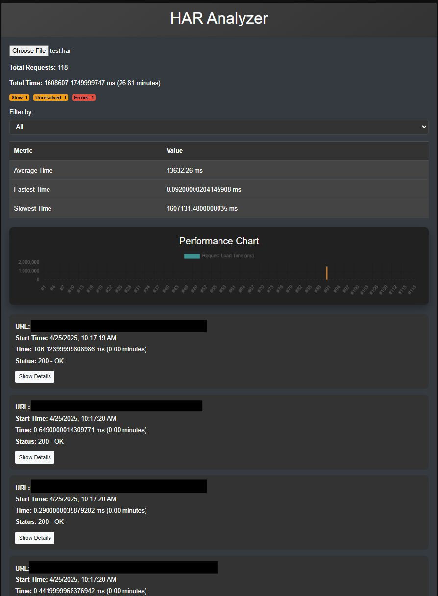

# HAR Analyzer

### Why?

Reports kept timing out and throwing tantrums, so I went full detective mode.

Opened DevTools, lived in the Network tab, captured the HAR like it owed me money.

Sure, there are a million online HAR readers.
No, I’m not uploading sensitive data to “definitely-not-sketchy-har-tool.com”.


### **HAR Analyzer Documentation**

### **Overview**

The HAR Analyzer is a web-based tool designed to analyze HTTP Archive (HAR) files. It provides a summary of the requests and allows filtering based on errors, slow requests, and unresolved requests.

### Features

- Full error handling and display
- Status explanations (404 - Not Found, etc.)
- Performance chart with Chart.js
- Statistics table (average, fastest, slowest times)
- Error summary (badges for slow, unresolved, errors)
- Details with full request/response info


### Example/Gui Snippets




### **Files Included**

1. **analyzer.js**: JavaScript file responsible for handling file input, parsing HAR data, and displaying results.
2. **Har.html**: HTML file that structures the web page and includes necessary scripts and styles.
3. **style.css**: CSS file that styles the web page elements.

File Structure: 

```graphql
HAR-analyzer/
├── favicon.icon
├── Har.html
├── analyzer.js
├── style.css
```

### **Description**

### **Har.html**

This HTML file structures the web page and includes necessary scripts and styles. Key elements include:

- **File Input**: Allows users to upload HAR files.
- **Summary Section**: Displays the summary of the HAR file.
- **Filter Dropdown**: Provides options to filter results.
- **Results Section**: Displays the filtered results.

### **analyzer.js**

This JavaScript file contains the logic for reading and analyzing HAR files. Key functionalities include:

- **File Input Handling**: Listens for changes in the file input element and reads the selected HAR file.
- **HAR Data Parsing**: Parses the HAR file and extracts relevant data.
- **Summary Generation**: Calculates and displays the total number of requests and the total time taken.
- **Results Display**: Displays individual request details including URL, start time, time taken, and status.
- **Filtering**: Filters results based on selected criteria (errors, slow requests, unresolved requests).

### Code Snippet .js

```jsx
document.getElementById('fileInput').addEventListener('change', function(event) {
    const file = event.target.files[0];
    if (file) {
        const reader = new FileReader();
        reader.onload = function(e) {
            try {
                const harData = JSON.parse(e.target.result);
                console.log('HAR Data:', harData); // Debugging statement
                summarizeHAR(harData);
                analyzeHAR(harData);
            } catch (error) {
                console.error('Error parsing HAR file:', error);
            }
        };
        reader.readAsText(file);
    }
});

document.getElementById('filterDropdown').addEventListener('change', function() {
    const filter = this.value;
    filterResults(filter);
});

let globalEntries = [];

function summarizeHAR(harData) {
    const summaryDiv = document.getElementById('summary');
    summaryDiv.innerHTML = '';
    const totalEntries = harData.log.entries.length;
    const totalTime = harData.log.entries.reduce((acc, entry) => acc + entry.time, 0);
    const summaryHTML = `
        <p>Total Requests: ${totalEntries}</p>
        <p>Total Time: ${totalTime} ms (${(totalTime / 60000).toFixed(2)} minutes)</p>
    `;
    summaryDiv.innerHTML = summaryHTML;
}

function analyzeHAR(harData) {
    globalEntries = harData.log.entries;
    displayResults(globalEntries);
}

function displayResults(entries) {
    const resultsDiv = document.getElementById('results');
    resultsDiv.innerHTML = '';
    entries.forEach(entry => {
        const url = entry.request.url;
        const startTime = new Date(entry.startedDateTime).toLocaleString();
        const time = entry.time;
        const status = entry.response.status;
        const unresolved = entry.response.status === 0;
        const resultItem = document.createElement('div');
        resultItem.className = 'result-item';
        if (time > 1000) {
            resultItem.classList.add('slow');
        }
        if (status >= 400) {
            resultItem.classList.add('error');
        }
        if (unresolved) {
            resultItem.classList.add('unresolved');
        }
        const urlP = document.createElement('p');
        urlP.textContent = `URL: ${url}`;
        resultItem.appendChild(urlP);
        const startTimeP = document.createElement('p');
        startTimeP.textContent = `Start Time: ${startTime}`;
        resultItem.appendChild(startTimeP);
        const timeP = document.createElement('p');
        timeP.textContent = `Time: ${time} ms (${(time / 60000).toFixed(2)} minutes)`;
        resultItem.appendChild(timeP);
        const statusP = document.createElement('p');
        statusP.textContent = `Status: ${status} - ${getStatusExplanation(status)}`;
        resultItem.appendChild(statusP);
        resultsDiv.appendChild(resultItem);
    });
}

function filterResults(filter) {
    let filteredEntries = globalEntries;
    if (filter === 'errors') {
        filteredEntries = globalEntries.filter(entry => entry.response.status >= 400);
    } else if (filter === 'slow') {
        filteredEntries = globalEntries.filter(entry => entry.time > 1000);
    } else if (filter === 'unresolved') {
        filteredEntries = globalEntries.filter(entry => entry.response.status === 0);
    }
    displayResults(filteredEntries);
}

function getStatusExplanation(status) {
    const statusExplanations = {
        0: "Unresolved Request",
        100: "Continue",
        101: "Switching Protocols",
        102: "Processing",
        103: "Early Hints",
        200: "OK",
        201: "Created",
        202: "Accepted",
        203: "Non-Authoritative Information",
        204: "No Content",
        205: "Reset Content",
        206: "Partial Content",
        207: "Multi-Status",
        208: "Already Reported",
        226: "IM Used",
        300: "Multiple Choices",
        302: "Found",
        303: "See Other",
        304: "Not Modified",
        305: "Use Proxy",
        306: "Switch Proxy",
        307: "Temporary Redirect",
        308: "Permanent Redirect",
        400: "Bad Request",
        401: "Unauthorized",
        402: "Payment Required",
        403: "Forbidden",
        404: "Not Found",
        405: "Method Not Allowed",
        406: "Not Acceptable",
        409: "Conflict",
        410: "Gone",
        411: "Length Required",
        412: "Precondition Failed",
        413: "Payload Too Large",
        414: "URI Too Long",
        415: "Unsupported Media Type",
        416: "Range Not Satisfiable",
        417: "Expectation Failed",
        418: "I'm a teapot",
        421: "Misdirected Request",
        422: "Unprocessable Entity",
        423: "Locked",
        424: "Failed Dependency",
        425: "Too Early",
        426: "Upgrade Required",
        428: "Precondition Required",
        429: "Too Many Requests",
        431: "Request Header Fields Too Large",
        451: "Unavailable For Legal Reasons",
        500: "Internal Server Error",
        501: "Not Implemented",
        502: "Bad Gateway",
        503: "Service Unavailable",
        504: "Gateway Timeout",
        505: "HTTP Version Not Supported",
        506: "Variant Also Negotiates",
        507: "Insufficient Storage",
        508: "Loop Detected",
        510: "Not Extended",
        511: "Network Authentication Required",
        520: "Web Server Returning an Unknown Error"
    };
    return statusExplanations[status] || "Unknown Status";
}

```

### Code Snippets .html

```html
<!DOCTYPE html>
<html lang="en">
<head>
    <meta charset="UTF-8">
    <meta name="viewport" content="width=device-width, initial-scale=1.0">
    <title>HAR Analyzer by ar1syr0</title>
    <link href="https://stackpath.bootstrapcdn.com/bootstrap/4.5.2/css/bootstrap.min.css" rel="stylesheet">
    <link rel="stylesheet" href="style.css">
</head>
<body>
    <div class="container mt-5">
        <div class="card bg-dark text-white">
            <div class="card-header text-center">
               1>HAR Analyzer</h1>
            </div>
            <div class="card-body">
                <input type="file" id="fileInput" class="form-control-file mb-3" accept=".har">
                <div id="summary" class="mb-3"></div>
                <div class="form-group">
                    <label for="filterDropdown">Filter by:</label>
                    <select class="form-control" id="filterDropdown">
                        <option value="all">All</option>
                        <option value="errors">Errors</option>
                        <option value="slow">Slow Requests</option>
                        <option value="unresolved">Unresolved Requests</option>
                    </select>
                </div>
                <div id="results" class="mt-3"></div>
            </div>
            <div class="card-footer text-center">
                <p>© 2025 Aristeidis Syrogiannis</p>
            </div>
        </div>
    </div>
    <script src="https://code.jquery.com/jquery-3.5.1.slim.min.js"></script>
    <script src="https://cdn.jsdelivr.net/npm/@popperjs/core@2.9.2/dist/umd/popper.min.js"></script>
    <script src="https://stackpath.bootstrapcdn.com/bootstrap/4.5.2/js/bootstrap></script>
```
